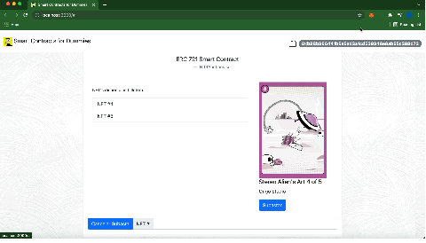
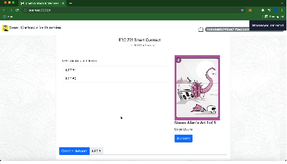

# Smart Contracts en Solidity

Proyecto realizado en solidity que tiene por objetivo aplicar los (humildes) conocimientos para smart contracts que adquirí en el curso del [Programando Smart Contracts y billeteras virtuales](https://mug-it.org.ar/577-Programando-Smart-Contracts-y-Billeteras-Virtuales.event.aspx).

## Connect Wallet

## Cambio de cuenta reactivo

## Subastar
Enviar al contrato SubastaNtf.sol un token que tiene en su billetera para poder subastarlo. 

*Notar que la primer operación es autorizar al contrato para usar el ntf y la segunda autorizar la transferencia del ntfs al contrato*

## Cancelar subasta
El usuario le solicita al contrato SubastaNtf.sol cancelar la subasta.

*Notar que luego de cancelada la subasta el nft regresa a la billetera del usuario*

## Disconnect Wallet

## Workflow
*pendiente la parte de ofertas*

## Herramientas

Este es un listado de las herramientas, frameworks y demas yerbas que usé para probar todo esto.

- [Truffel](https://www.trufflesuite.com)
- [Ganache](https://www.trufflesuite.com/ganache)
- [Metamask](https://chrome.google.com/webstore/detail/metamask/nkbihfbeogaeaoehlefnkodbefgpgknn?hl=es)
- [Pinata](https://pinata.cloud/)
